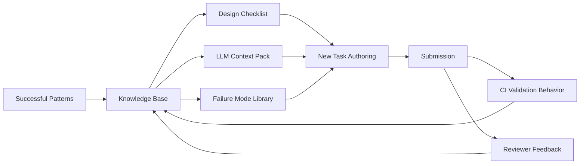

# Knowledge Loop

```mermaid
flowchart LR
    A[Successful Patterns] --> D[Knowledge Base]
    B[CI Validation Behavior] --> D
    C[Reviewer Feedback] --> D
    D --> E[Design Checklist]
    D --> F[LLM Context Pack]
    D --> G[Failure Mode Library]
    E --> H[New Task Authoring]
    F --> H
    G --> H
    H --> I[Submission]
    I --> B
    I --> C
```
