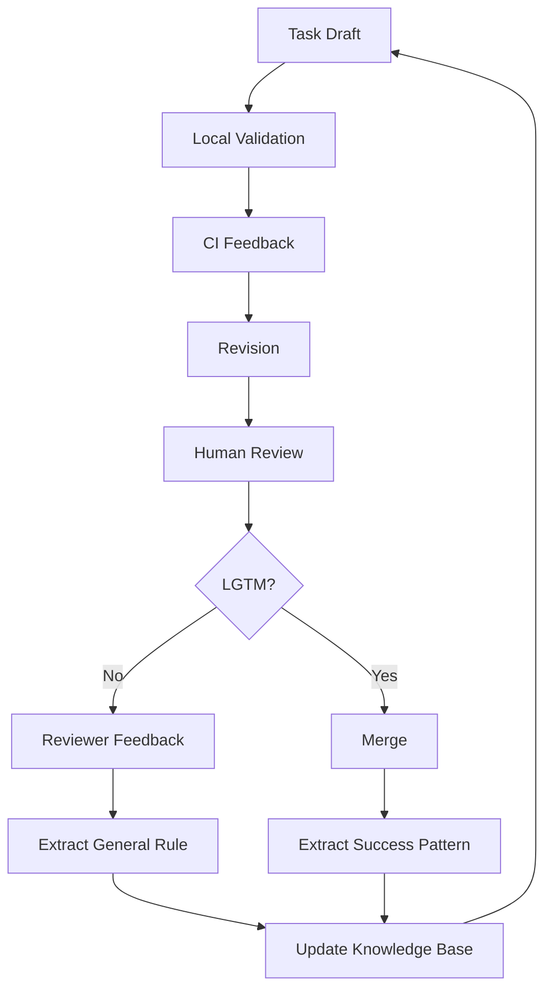

# Workflow Diagram

```mermaid
flowchart TD
    A[Task Draft] --> B[Local Validation]
    B --> C[CI Feedback]
    C --> D[Revision]
    D --> E[Human Review]
    E --> F{LGTM?}
    F -- No --> G[Reviewer Feedback]
    G --> H[Extract General Rule]
    H --> I[Update Knowledge Base]
    I --> A
    F -- Yes --> J[Merge]
    J --> K[Extract Success Pattern]
    K --> I
```
